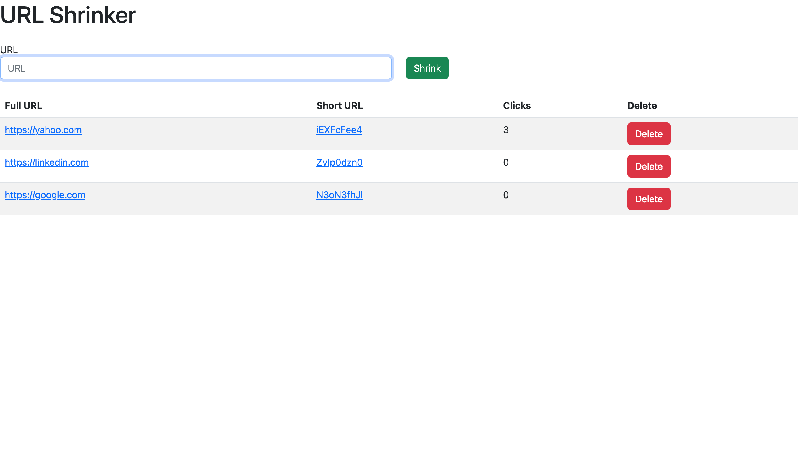

# URL Shortener 

## License
   

   Please click on the badge to view license info.

## Table of Contents

- [License](#license)
- [Description](#description)
- [Deployed Link](#deployed-link)
- [Installation](#installation)
- [Usage](#usage)
- [Visuals](#visuals)
- [Tests](#tests)
- [Contributors](#contributors)
- [Contact](#contact)

## Description
This project allows the user to shorten any URL and count how many times a link has been used.

## Deployed Link
https://url-shortener-ssb.herokuapp.com/

## Installation
None.

## Usage
To shorten URLS

## Visuals

## Tests

No.

## Contributors

Sherreka S. Burton

## Contact

If you have any questions about this project please contact: Sherreka S. Burton

Github: [ssbbgm](http://github.com/ssbbgm)

Email: ssburto825@gmail.com